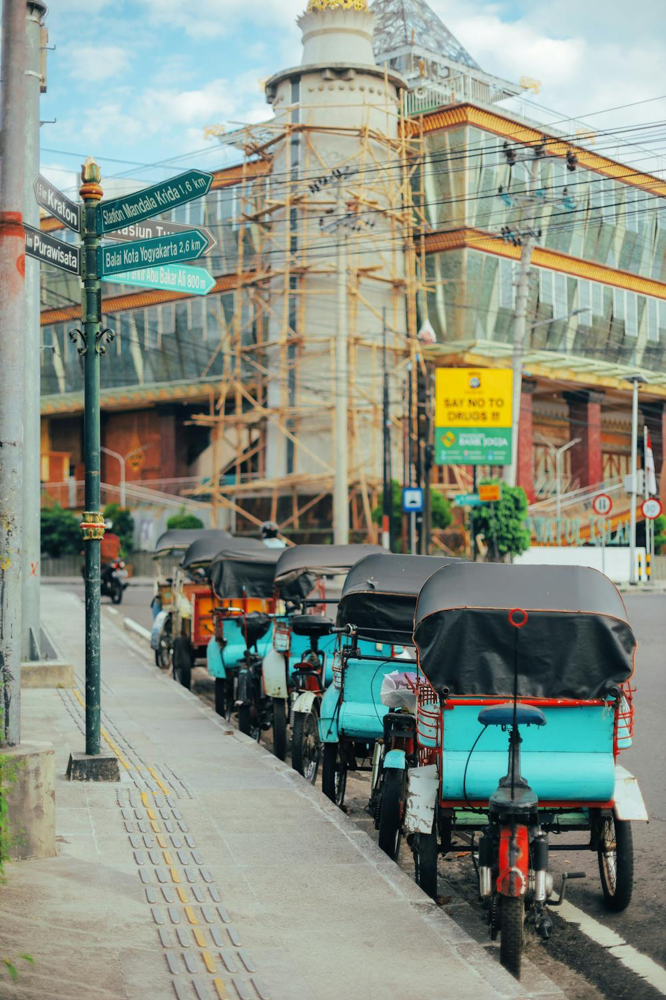
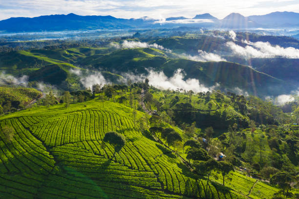
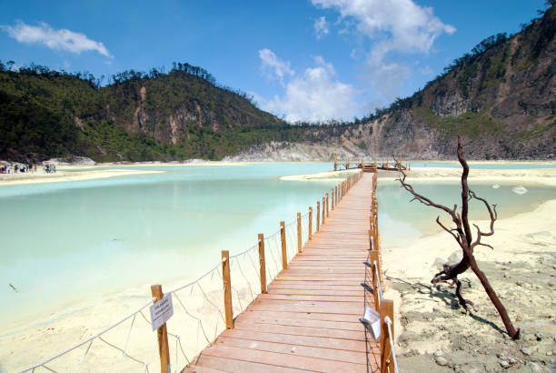

<!DOCTYPE html>
<html lang="id">
<head>
    <meta charset="UTF-8">
    <meta name="viewport" content="width=device-width, initial-scale=1.0">
    <link rel="stylesheet" href="style.css">
    <link rel="stylesheet" href="https://cdnjs.cloudflare.com/ajax/libs/font-awesome/6.5.2/css/all.min.css">
    <title>Document</title>
</head>
<body>
    
<!-- nav -->
    

        

            <h2>Pesona Indonesia</h2>
        

        <ul class="data-list">
            <a href="#"><li>Home</li></a>
            <a href="#"><li class="wisata">Wisata <i class="fa-solid fa-angle-down"></i>

                <ul class="list">
                    <a href="/Bali/bali.html"><li>Bali</li></a>
                    <a href="/Yogyakarta/yogyakarta.html"><li>Yogyakarta</li></a>
                    <a href="/Bandung/bandung.html"><li>Bandung</li></a>
                </ul>

            </li></a>

            <a href="/Galeri/galeri.html"><li>Galeri</li></a>
            <a href="/Kontak/kontak.html"><li>Kontak</li></a>
        </ul>
    

    <!-- nav selesai -->

    <!-- header -->

    

        <h1>Wisata Indonesia</h1>
    

    

        
    

    <!-- header selesai-->

    <!-- card -->
    

<a href="/Bali/bali.html">
    

        

            
        

        

            <h2>Bali</h2>
            
 Tempat wisata Nusa Peninda yang berlokasi di Pulau Bali

        
        

    

</a>
<a href="/Bali/bali.html">
    

        

            
        

        

            <h2>Bali</h2>
            
 Tempat wisata Tanah Lot yang berlokasi di Pulau Bali

        
        

    

</a>

<a href="/Yogyakarta/yogyakarta.html">
    

        

            
        

        

            <h2>Yogyakarta</h2>
            
 Tempat wisata Candi Borobudur yang berlokasi di Yogyakarta

        
        

    

</a>

<a href="/Yogyakarta/yogyakarta.html">
    

        

            
        

        

            <h2>Yogyakarta</h2>
            
 Tempat wisata Malioboro yang berlokasi di Yogyakarta 

        
        

    

</a>

<a href="/Bandung/bandung.html">
    

        

            
        

        

            <h2>Bandung</h2>
            
 Tempat wisata Ciwidey yang berlokasi di Bandung 

        
        

    

</a>

<a href="/Bandung/bandung.html">
    

        

            
        

        

            <h2>Bandung</h2>
            
 Tempat wisata Kawah Putih yang berlokasi di Bandung 

        
        

    

</a>

    <!-- card selesai -->

    <!-- Footer -->

    
Web Design by Ferry Andika Firmansyah

    <!-- Footer selesai-->
</body>
</html>
